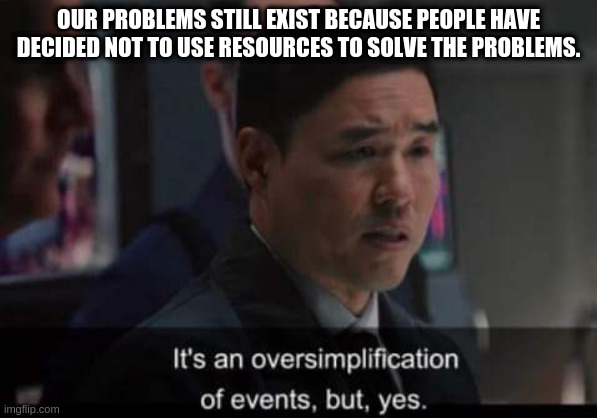

I have a rather big personal project - my current estimate says it will take me around 10 years to develop it. This newsletter is a running log on its progress and the things I learned along the way. The project is MindOS and this is the story behind it...

I'm an engineer. **I always thought that humanity will solve its problems with technology**. But as I grew older, I understood that **we have figured out the technological solution to almost all our problems**. We don't have any big existential threats from our environment(as a matter of fact, now we are the existential threat to the environment). There is only one thing tech hasn't figured out yet - natural death. All other problems have solutions now - with very few exceptions.

But the world is still no were close to perfect. There are quite a few problems. **People still die due to preventable causes** - things like poverty, preventable diseases, wars and many, many other issues.

Technology has already figured out solutions to this - humanity can easily create all the food it wants. It can solve almost all communicable diseases. But these **problems still exist because people will have to decide to deploy the technology to solve that issue**. But the people who have to decide this, actively **decide to do the opposite**. Yes, this is an oversimplified version of a very complex situation - but you know I'm right.

There are many reasons for why people make the "wrong" decision. In my opinion, these are the main two reasons for this. These are my personal silver bullets - solve these and most of world's problems go away...

1. Wealth Inequality
2. Nation states

## 2. Nation States(Macro Level)

People in power don't have the motivation to help people in desperate need because **they belong to another country**. This other-ing is a very strong programming in our mind - and its difficult to over come - especially when re-enforced with existing social institutions. Human behavior is not just driven by the programming in our brain - but also the programming in our environment.

> The real problem of humanity is the following: we have Paleolithic emotions, medieval institutions, and god-like technology
> Edward O. Wilson

Nation states are a really old institution - at our level of communication infrastructure, we need a global nation. Just too many problems will get solved if this happens - including one that is a existential threat to humanity - a thermo-nuclear world war. The biggest wars are caused by the nation states ideology - including 100% of the world wars so far(yes, I know that there were only two of those - but 100% seems like a better way to illustrate my point).

## 1. Wealth Inequality(Micro Level)

Capitalism won out as surviving primary economic belief system. It was a good system at a lower communication level - it aligned people's motivations with a very quantifiable system. But now we can figure out better economic belief systems. Getting people to switch their belief system is the tricky part - especially if they are "winning" at capitalism. And unfortunately, their votes count way more than people in the other side.

I chose this as the biggest problem over the many other problems. Over sexism, racism, communalism, casteism, homophobia - over everything. I would much rather be a rich person from a marginalized community than a poor person from a non-marginalized one. I would rather be a rich Dalit lady than a poor Brahmin dude(If you not from India, the example would be that I would rather be a rich lesbian black woman than a poor straight white guy). **Money solves a lot of problems - or at least reduces its threat** level greatly. If I had to prioritize one problem over all others, it would be wealth inequality.

## A new Belief System

One way to solve for these issues is to have **better belief systems**. This is were religions comes in - but the ones that are popular are, again, medieval institutions. We need an updated belief system.

People close to me will be surprised by that statement - I'm generally anti-religious. I'm learning to give that up. In a couple of generations, the number of people affiliated with a religion will go down greatly. For most parts, it is a good thing - there is quite a lot of problems caused by religions. But there are some advantages to religions as well. My favorite one is faith.

**Faith**, in my definition, is the almost irrational **belief that things will become better**.

In most religious belief systems, the faith is that there is a good God and you will be taken to heaven after you die if you live a good life.

In capitalism, there is an unwavering faith that raising tide lifts all boats(also known as trickle down economics).

In nation states belief system, its that if both parties have nuclear weapons there won't be any war.

Most belief systems we have today are evolved belief systems. Some things work out organically - and then someone comes along, studies the system and says this is why it works. If enough people agree with this analysis, then it becomes the holy un-questionable truth.

We need **better belief systems. Intentional belief systems. Modern belief systems**.

We need to create a belief system that will have an ideal world future and work backwards. If X% of humanity believes these things, the world will be so. Get this belief system to that many and hopefully it will trigger a change in the world.

## MindOS

For me, **this new belief system is an Operating System for the Mind. Aka, MindOS**. Aka, my personal project.

To this end, I'm getting into Philosophy. And related fields like Rationality, Psychology. And since my production is a very important factor in this project, I'm also getting into Personal Knowledge Management systems, learning systems and productivity self help(for the lack of a better phrase). 

This newsletter is where I will be publishing my learnings every month. I'm hoping that some day I'll be able to do one a week. That would be my measure for the success of this newsletter. But not its target. That would make for a horrible target.

A target I have would be reader enjoyment. I want you'll to have fun when going thru this content. It's a system I call standup philosophy. That means I talk about philosophy for the sake of entertainment rather than enlightenment. But if you get slightly enlightened as a result, I would consider that a happy side effect.

The other target will be you talking about an idea you had when you read this newsletter. With a friend on a chat. Posted a tweet about it. Talked about it to another person. Anything. So, please do that, it gives me a serotonin hit that will motivate me to put more work into this project. This target will ensure that I create content that will create ideas in you.

## Tl;dr

Welcome to my newsletter. It will have contents from these areas...

- Philosophy
- Rationality
- Psychology
- Knowledge Management Systems
- Learning Systems
- Productivity Self Help

The newsletter will be the documentation of knowledge and skills I build during the course of my project to develop **MindOS**(Operating system for the mind).
