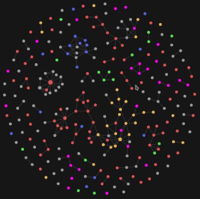

The [goal of MindOS](https://binnyva.substack.com/p/hello-world) is to create a collection of belief systems that will work as a mental operating system. I have no idea how to do that - but I do know frameworks that can get me to the solution. When you try to figure out how to do something new(like, oh, I don't know, build a OS for the MIND?), you should NOT start thinking of solutions. You should focus on the problem you are trying to solve. **Study the problem** as much as possible.

To this end, I'm studying about the prior work done in this field - which is philosophy. Since mind is a big component of MindOS, I have to learn psychology. And other content like Rationality, Management Systems, etc.

When you start learning, you realize that there is a lot of content to go through. Because there is a LOT of content and that too in mostly unconnected fields, I understood that I'll need a better learning system. Something that will increase my learning efficiency. Once I figured that, I started researching on better learning systems, knowledge management systems, etc. 

That's when I learnt about Zettelkasten - and it is BRILLIANT. I started using it an year ago - and its really working out. All the content I've produced in the last few months is the direct result of using the Zettelkasten system.

## Zettelkasten System

The idea behind Zettelkasten is very simple - when consuming content, take notes in a specific format. Make sure you are writing these notes in your own words - do NOT copy paste content directly into your notes. Knowledge is not created when information goes into your brain - **knowledge is synthesized when you attempt to pull out information already in your brain**. This happens when you try to explain the concept to another person. It happens when you create some content with it. It happens when you make a note in your own words about what you just learnt. 

Since it helped me a lot, I spent the last few months trying to figure out how to get it to as many people as possible. To this end, I did sessions, workshops, created posts and videos. Now I have created the final version of my Zettelkasten Tutorial - [An Interactive Introduction to Zettelkasten](https://binnyva.com/zettelkasten/). The tutorial will walk you through the process - and give you the necessary building blocks to implement it for yourself.

Zettelkasten is a **note taking process and a personal knowledge management system** rolled into one. It is spreading like wildfire in tech and academic circles. I promise it will supercharge your learning process.

Zettelkasten works as an **external support system for your thinking** process. The main point of Zettelkasten is not better notes - its better thinking. Some type of externalization improves your thinking greatly - be it paper and pen, mind-maps, text editor, anything - as long as it's outside your brain. Unlike other note taking systems, the Zettelkasten process forces you to actually think while creating notes - this will let you better understand and remember the concepts that you learn.

Zettelkasten is not complicated - its very simple to implement. The **difficult part is creating a habit or behavior of making notes** when learning. You'll have to figure out how to create a trigger to take notes when you get new information. For me, I don't consider any action of study as study unless I take notes. 

Zettelkasten will be a big part of my MindOS - it has greatly optimized my learning process. I've been using this method for over an year now - and currently I have a web of interconnnected ideas in Obsidian(the tool I use for Zettelkasten).

## Learning In Public

After 2 years of only learning about the problem, I realized that I have to stop just learning about it and start publishing something. This newsletter is one of the first artifacts of this decision. But it is a more polished version of what I learnt. There is a much more 'raw' version as well.

One unintended, but really useful, feature of Zettelkasten for me is how all your learning can be public. The notes you take can be published online(how you do it depends on the tool). I have created a tool called [Gatsby Garden](https://github.com/binnyva/gatsby-garden) that will convert the Obsidian notes into a static site. I publish it once every week on my [Digital Zen Garden](https://notes.binnyva.com/) website. This is the raw version. This is where the actual learning happens. This system is called [Learning in Public](https://www.swyx.io/learn-in-public/).

This is the part I want your help with. I'm publishing my learning so that people can read it and give me feedback on the direction I am going in. MindOS is a big project - and one with a lot of "unknown unknowns". I'll be happy to get whatever support you have to offer in this journey. I have no intention of creating MindOS in isolation. Ideally, this OS should be created how Linux was created - by the community. I just want to create the Kernel or the Core of it - and let others build upon it. Modify it. Make it your own. Your mind, your MindOS.

