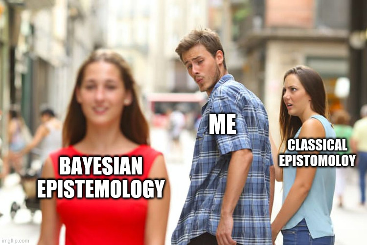
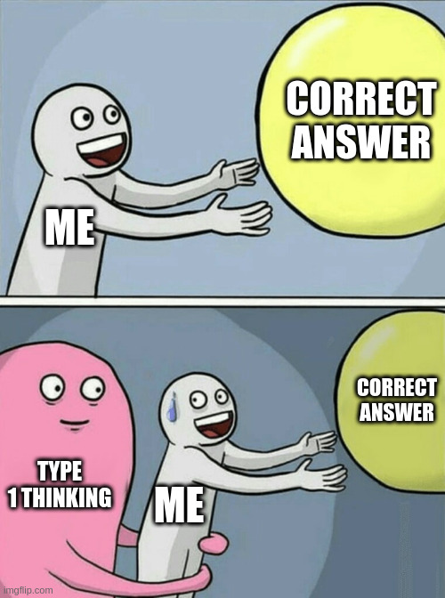

I am trying to [create a set of belief systems](https://binnyva.substack.com/p/hello-world) that will act as an Operating System for the Mind. When I tried studying about belief systems, and [knowledge management systems](https://binnyva.substack.com/p/learning-about-the-problem), I found out about Epistemology. **Epistemology is the theory of knowledge**. It's a branch of philosophy that deals with questions about knowledge - questions like how can we know things? What is knowledge?

I have been studying this for over a month now - so I have to make it absolutely clear that knowledge and belief are two separate things. In fact, the only thing most philosophers can kind of agree on is that **Knowledge is "Justified true belief"**. Your belief is knowledge if...

- It's true.
- It's justifiable - you came to this conclusion in a reasonable way.

All this agreement goes out the window if someone happens to look at a broken clock at the exact time that is shown on the clock. Don't worry if you don't understand that - it's a philosophy joke. You gettier it, or you don't.

## Probabilistic Knowledge

I have one main problem with Epistemology - **I don't like this absolute true/false idea**. It's a false dichotomy that you are trapped into. A way better option is using a probabilistic approach. Thankfully, other people have already thought of that - there is a branch in Epistemology called Bayesian epistemology.

Bayesian probability is a branch of probability that tells you **how to update probability values when you get new information**.

In Bayesian Epistemology, **complete confidence(probability = 1) in an idea is horrible**. This is because if you have complete confidence you can disregard all evidence to the contrary - which is horrible in practice. So, we have to use probabilistic Epistemology for practical life.

There is a book about this concept - but described in another way - Thinking in Bets. Rather than decide if something is true or false, think "Would I bet on it?". How much are you willing to lose if this idea is not true?

There is a weird thing that our brain does - when we come up with a solution to a problem, the brain tries to defend that idea. It does this by **ignoring evidence against the idea - and highlighting/prioritizing evidence that confirms** your idea. This is called motivated reasoning or confirmation bias.

When you try to assign probability values to your solution, you engage your analytic side of the brain(also known as type 2 thinking). This is a better method to find faults with your own idea.

## Type 1(Quick, Intuitive) and Type 2(Slow, Reasoned) Thinking

Type 1 thinking is immediate, creative and automatic. Type 2 requires work - you have to reason through the issue. **Type 1 does pattern matching with earlier problems** that look kind of like the problem you have right now - and decides on a solution that you have come to earlier. You can see it in action if you try to solve this problem...

You bought a ball and a bat with 110. The bat costs 100 Rs more than the ball. How much did the ball cost?

Take a moment and try to find the answer.

Type 1 thinking immediately gives you an answer - 100 Rs for the bat and 10 Rs for the ball. But then the bat only costs 90 Rs more than the ball. If you actually use the algebraic equation that you thought you'd never have to use, you'll know that the answer is actually 5 Rs for the ball and 105 Rs for the bat.

If you use the algebraic equations, you are forcing your brain to use Type 2 thinking - it's slow - but less susceptible to errors.

An obvious conclusion here is that Type 1 is bad and Type 2 is good. This is an easy mistake that, again, Type 1 in your brain is making. Both are very necessary. You don't have to think actively about driving - because you have done it enough that it's Type 1. Type 1 is a cognitive shortcut. It's valuable - but susceptible to errors - if you are aware of it you can double check your decisions using Type 2.

The world is too complex to be viewed in a binary system like right or wrong, true or false. Or as Obi-Wan puts it, "Only the Sith deals in absolutes". Learn to see the world in probabilities that can be updated when you get more information. Actively do that in your life - keeping in mind that your mind will try to take shortcuts that will give you wrong answers. You'll have to offset for that as well. 

