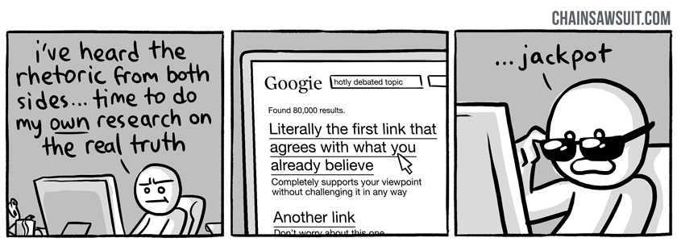

[MindOS](https://mindos.in/) is a project to create a set of belief systems that will act as an [Operating System for the Mind](https://binnyva.substack.com/p/hello-world). But to install this OS in your mind, you need to unlearn a few things that you currently believe.

Unlearning is the process of **examining our belief systems and updating our beliefs** if it does not match with reality. Unlearning is a big part of learning. But it is difficult - you have to admit to yourself that you might be wrong about some things. That you are uncertain about a few things. **Being okay with uncertainty is critical for being accurate**.

We are programmed to seek certainty. This leads us to simple answers that are coherent enough. But the world is not simple - the real answer might not fit into something you think of as coherent.

The biggest obstacle to Unlearning is that our brain is programmed to fight for its ideas. Once you have a belief, your **brain thinks of all opposing ideas as attacking ideas** which should be defended against. This is called the Soldier mindset.

The antidote to this is the [Scout mindset](https://www.goodreads.com/en/book/show/42041926-the-scout-mindset). The scout's role is not to defend your territory - it's to **go out into the world and update your maps** of the world. Map is a representation of the territory(ie. reality) within your mind. The closer your map is to the territory, the better it is. But at the same time, understand that the map is not territory. Your knowledge of reality(your map) is only a representation of reality(the territory). There will be gaps in your information, even entire continents that have not been visited yet. The Unknown unknowns.

Few ways your brain fights against ideas that contradict your beliefs...

### Motivated Reasoning

**We tend to accept/believe more easily and with less scrutiny things we think are correct**. If we encounter an idea that we think is wrong, we subject it to more scrutiny - it has a higher bar to clear for us to accept it.

A sutler form of this is **holding opposing views to a higher standard of proof**(sample size of that study is too low, the author of that study is not qualified enough), while being lenient towards confirming viewpoints.

### Confirmation Bias

Confirmation bias is the tendency to...

- search for
- favor
- recall 
 
... data/evidence in a way that confirms or supports one's prior beliefs or values.

Both these **effects are stronger for deeply held beliefs**, identity topics, or strong emotional triggers. If your bond with the idea(eg. a core belief) is too strong, it can trigger the Backfire effect when you get information that contradicts your idea. If that happens, you will ignore the evidence and believe more strongly in your existing belief. This idea is illustrated in a funny way in [this comic](https://theoatmeal.com/comics/believe).

#### Example Activity

Learning about the theory is easy - but to fully understand something, you need to live it. To that end, here is a small activity that will help you understand the concept.

Think of the current ruler of your country. Picture them in your mind. Be mindful of your thoughts about this person. Now, answer this question: Do you like this person? Yes or no.

- If **yes**, think of five way they have failed their position.
- If **no**, think of at least five good things they have done for the country. 

How easy was it to think of things that went against your beliefs? How much did the mind try to give you justifications on why its earlier belief was correct? Did you even manage to complete this activity? That is motivated reasoning in action.

This will work better if you have strong beliefs about the ruler in question. If not, try the same activity with something else that you have very strong beliefs about - your country, your gender, your favorite sports team.

Being proven wrong, or even being forced to consider being wrong about your closely held beliefs **triggers the same parts of your brain(Amygdala) that are triggered when you are in physical danger** - and it can cause a fight or flight response.

## Updating your Mental OS

Updating your core belief systems is a critical part of updating your Mental Operating System. To do this, you'll have to learn how to move from a soldier mindset to a scout mindset. You'll have to learn to recognize when your mind protests against an idea - and even when it tries to subtly lead you away from different viewpoints. You'll have to fight against your own brain to get better at this.

Truthfully, I'm not sure how to do this perfectly yet. I'm also in the journey of learning it. These are a few things that helped me...

- Ask yourself "Do I want this to be true?". If yes, be very careful - you will be more vulnerable to reasoning errors.
- Make it a point to think of at least four arguments against your position.
- Put in the time to reflect on the limits of your knowledge in the area you are working on.
- Be mindful when your brain reels away from an idea - or starts finding arguments against an idea automatically.

Understand that this is difficult to do. Second guessing your own brain is not something that people are used to doing. You will fail at times. But, understand that this is important - you will make more accurate choices if you learn to do this.
