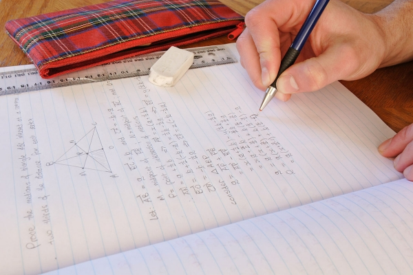

In the last [article about Unlearning](https://mindos.in/posts/04-learning-unlearning/), I talked about Motivated Reasoning and Confirmation Bias. These are two examples of thinking flaws. They are **bugs in our brain's programming**. There is a huge list of such brain bugs - they are called Cognitive Biases.

Ask any programmer and you'll know that their bugs are not actually bugs - they are just undocumented features. Similarly, these cognitive biases are not just bugs. They are actually features called heuristics. **Heuristics are shortcuts that the brain uses to reach an answer** in an easier way. The brain looks at the problem and tries to do pattern matching against all the problems it has solved in the past. If it finds a match that is close enough, it tries to use the same solution it used in the past for the new problem. The result: Brain bugs. Again, as the programmers say, premature optimization is the root of all evils. 

So, what can we do about these bugs? Patching it is not possible(at least, not anytime soon). Again, programmers have the answer - work-arounds. **You don't fix the problem per se - we just learn how to work around it**. It seems like programmers have the answer to all questions, doesn't it?

## Solving for Cognitive Biases

Work-arounds for Cognitive Biases are not very easy. The work-around is **knowing all the biases you might have - and being mindful in the triggering situations**. Eg, if you encounter a claim that you want to be true(this is a trigger situation for Confirmation Bias), then you should be mindful of your reactions. Be aware that you might be under the influence of confirmation bias - and compensate for it. Investigate the claim more, even if you think it's true.

To do this well, you need to know all the cognitive biases that exist in your brain. Easy - I have created a page that lists [175 Cognitive Biases](https://mindos.in/thinking-flaws/). Just learn and internalize all of them. 

175 is too many, you say? Then learn the 5 most common ones...

## Top 5 Biases

### 1. Self Serving Bias

You have a need for strong self esteem. You need to feel important. To this end, **our thinking, perception and memories are distorted in ways to make sure that you view yourself in a positive light**. These distortions are called [self serving bias](https://mindos.in/thinking-flaws/self-serving-bias). There are a lot of related biases as well. For example, you think that your perceptions are more accurate - [Egocentric Bias](https://mindos.in/thinking-flaws/egocentric-bias). You think that your views are what most people believe - [False consensus effect](https://mindos.in/thinking-flaws/false-consensus-effect). All of this works together to make sure you overestimate and hold on to your existing beliefs.

### 2. Fundamental Attribution Error

Attribution is a psychology term that means **assigning cause of an event**. Basically, figuring out what or who to blame for what has happened. Here also, Self serving bias comes into play. If you had a negative experience(say, you're late to finish a project), you tend to blame external causes(example - scope of the project kept changing). At the same time, if someone else had a negative experience, you tend to blame it on their personality defects(example - their project was delayed because they are lazy). **In case of a negative outcome for yourself, you tend to attribute it to an external cause. But if there was a negative outcome for someone else, you attribute it to their personality(internal cause)**.

This works at a [group level](https://mindos.in/thinking-flaws/ultimate-attribution-error) as well. If the negative thing happens to someone in your in-group(a group that you belong to), it's because of external causes. But if it's an out-group, it's because of their character  flaws. This is [In-group bias](https://mindos.in/thinking-flaws/in-group-bias) in action.

### 3. Confirmation Bias / Motivated Reasoning

I've already talked about this duo in my last [article about unlearning](https://mindos.in/posts/04-learning-unlearning/). You want to **keep believing what you already believe - to that end you'll ignore opposing ideas**. You'll subject opposing ideas to higher standard of proof so that they can be rejected easily. 

### 4. Hindsight Bias

We are very clever once we already know the solution. That effect is [Hindsight bias](https://mindos.in/thinking-flaws/hindsight-bias). You tend to think the outcome was very predictable AFTER the outcome has happened. 

"They broke up? Of course, it would have happened - I knew all along that it would end."

**This effect can distort your memories in a way that you think that you "knew-it-all-along"**. This effect is so strong that many experts think that true analysis of any decision can be done only before you know the outcome.

### 5. Optimism Bias/Pessimism Bias

**Optimism bias is when you believe that a lot of good things will happen to you. Pessimism bias is when you believe that a lot of bad things will happen to you**. The truth is in the middle - a lot of normal things will happen to you.

If you are depressed, you are more likely to go into pessimism bias. If you are an Entrepreneur, you are more likely to have an optimism bias. 

### Free Extra: Bias blind spot

This bias will be a big problem once you learn about biases. Its **easy to spot biases in others - but extremely hard to see it in yourselves**. Other biases like [Naive Cynicism](https://mindos.in/thinking-flaws/naive-cynicism)(expecting others to be biased), and [Naive realism](https://mindos.in/thinking-flaws/naive-realism)(belief that you are super objective at all times) won't help make it any easier to spot bias in ourselves.

## Homework

I have been learning a lot of things for this project - and my favorite learning method is active learning. **In active learning, you have to use the things you learn** to make it stick. So, this time around, you get some homework... 

**Notice at least one instance** of any of the above cognitive biases in yourself or others around you. You'll get extra points if you notice it within yourself - because you managed to get over Bias Blind spot.

If you manage to spot one, please share it with me. Don't share it with them - they are not going to take it well. Instead share this page with them. Way more subtle way of saying they are stupid. 

For extra credits, **go through the other biases** as well. They are clustered around the problems that the bias tries to solve...

- Information overload
- The Need for meaning
- The need to act fast
- What should be remembered?

See all of them in one place at...

<a href="https://mindos.in/thinking-flaws/"><strong>Thinking Flaws</strong> - cognitive biases, fallacies, psychological weirdities and more</a>

