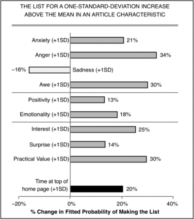
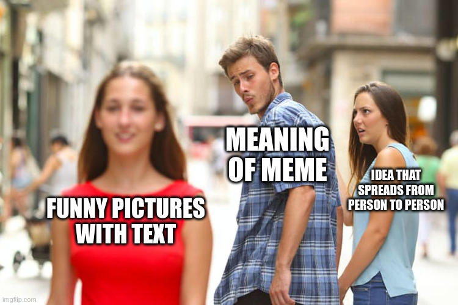

We have been talking about [Belief Systems](http://mindos.in/posts/06-belief-systems/) for the last few posts. There is enormous power in belief systems - if you can change your belief system, you can change your subjective reality. Therefore, you need to be careful on which belief system you accept. You get most of your belief system about **how the world is currently from news sources and social media**. But these sources(especially Social Media) are not designed to give you the best belief systems. They have evolved for maximum sharability - not for accuracy. And that can have a negative impact on you.

The **content is more likely to be shared if it can evoke powerful emotions** in you. Of all the emotions, anger is the best option for increasing sharing. **Anger can by-pass our internal sense checks - and get you to act** quicker. These are how the other emotions work in increasing sharability according to a [study on what makes online content viral](https://journals.sagepub.com/doi/abs/10.1509/jmr.10.0353)...

As you can see, Anger is the top scorer. That's the one you should be worried about the most. 

These content are not created once and then never changed. When they are re-posted, people edit it - **tweak it in a way that pushes people's buttons** better. Their emotional impact can increase every time it goes thru this process. Think of it as mutations in the process of evolution. The end result is a post that is really good at pushing your buttons - that has the best chance for virality.

## Memes: Idea organisms

Thinking of ideas as organisms that go thru evolution is not a new thought. The word "meme" originally meant exactly that...

> Meme is an idea, behavior, or style that spreads by means of imitation from person to person within a culture.

It was an attempt by Richard Dawkins to use the science of parasitology to explain cultural evolution. He tried to move away from the view of people selecting which ideas to have - towards a view that **ideas are parasites that live in peoples brain - and they evolve in a way that favors their survival and reproduction**(spreading to more people).

Of course, today meme is used to refer to something else entirely...

For the purposes of this article, its helpful to think of ideas as the original meaning of meme. As parasites that lives in people's brains - that will go thru evolution so as to maximize survival and reproduction. Now the idea of "content being edited and in that process evolving" fits better. Its just ideas that want to increase their own survival. 

## Stage 2: Ideas working together

However, there is a limit to how long it can survive. An idea can spread, stay relevant on the internet for a while. After that it will reach a saturation point. People are not going to keep sharing the same thing again and again. At this point, **we get "herd immunity" against this idea**. At least, that's the theory.

But memes have figured out a way around this. All it needs is an **opposing idea on the other side**. If there is an opposing idea, the people holding the idea will fight against the opposing idea. At this point the **two ideas are in a symbiotic relationship** with each other - even though their content is the opposite. Continued survival of one idea is dependent on another idea.

At this "outrage" point, people in both group are not attacking the other group. They would have **created a representation of the out-group among themselves** - and all their attack is focused on this construct of the out-group. Its almost always very different from what the out-group is actually like.

We are really bad at creating such constructs for an out-group. Our construct building will be aiming to making the out-group look bad - not accuracy. We have too many **cognitive biases that make sure we vilify** the out-group...

- [Group attribution error](https://mindos.in/thinking-flaws/group-attribution-error): Belief that the characteristics of one person in a group must be there in all.
- [Ultimate attribution error](https://mindos.in/thinking-flaws/ultimate-attribution-error): Explains the negative behaviors of out-group(others) to personality defects and negative behaviors of the in-group(us) to external circumstances or chance.
- [Out-group homogeneity bias](https://mindos.in/thinking-flaws/out-group-homogeneity-bias): The belief that the people in the out-group are very similar to each other.
- [In-group bias](https://mindos.in/thinking-flaws/in-group-bias): Favoring people of your in-group over people outside.

## Exercise

Now that you know the theory, I have a practical exercise for you. Open your Social Media news source - it can be Instagram or Twitter(or something else too). Find a post that is a commentary of a news story. See if you can figure out the following things...

- Who the in-group its written for?
- Who is the out-group? 
- List a few characteristics of the construct of the out-group that it targets.

Next time you encounter some social media outrage over an issue, remember that they are attacking a representation. Its an exaggeration of reality.

- The quote they took will be the most extreme quote
- The person they quoted will be the most extreme
- The event they are highlighting will be an exception - and picked because it makes people angry
- It would have been tweaked in a way to push your buttons

This is **basic mental hygiene**. Doing this multiple times will build in you a healthy disregard for social media commentary. Doing it enough will reduce your anxiety. Overtime, it will make the world look better - because you would have learned to ignore the worst news about it.

## Credits

- Photo by <a href="https://unsplash.com/@cdc?utm_source=unsplash&utm_medium=referral&utm_content=creditCopyText">CDC</a>
- [This will make you angry](https://www.youtube.com/watch?v=rE3j_RHkqJc)
- [The Toxoplasma Of Rage](https://slatestarcodex.com/2014/12/17/the-toxoplasma-of-rage/)
