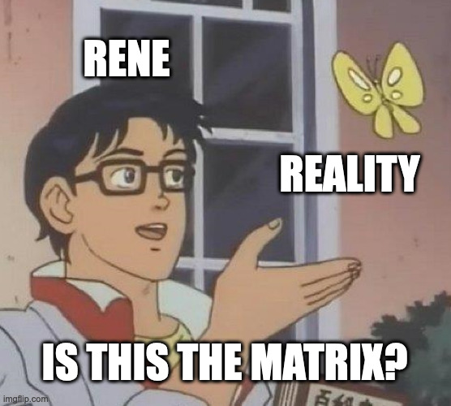
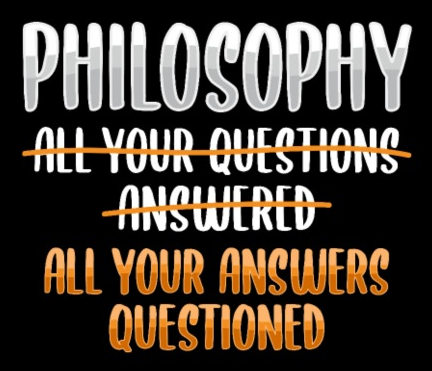

As I start my new '[Know Thyself](https://mindos.in/posts/12-know-thyself/)' project, the first place I got to is Philosophy. Yes, it's a crutch.

Thankfully, but typically, philosophy has a lot to talk about it. The idea of 'No-self' from Buddhism caught my interest.

### Self in Eastern Philosophy 

According to Buddhism, the study of self is how Buddha reached enlightenment. In his initial years, he learned multiple meditation systems from various gurus - but nothing gave him enlightenment. But those experiences turned his mind into a sharp instrument. Then he turned that instrument to study his own mind. What he learned about the nature of his own mind led to his enlightenment.

Buddha found that he has five parts within himself...

- **Form**: Physical body
- **Feeling**: Emotions
- **Cognition**: Thoughts, memories, plans, ideas
- **Mental Formations**: Volitional activities, dispositions, decision making
- **Consciousness**: Fact of awareness

According to Indian philosophy of the time, the self had two characteristics...

- it would be perfectly under the control of oneself
- it has to be permanent

Buddha couldn't find any aspect of the self that fulfills those criteria, he preached the idea of 'no-self'. The idea of no-self should not be interpreted that there is no 'self' - but rather that the two qualifiers given above are not correct. We are constantly changing, and a healthy detachment to the self is useful to reduce suffering.

At the same time, Hindu philosophy at the time goes to the other extreme. According to it, the self is the 'witness-consciousness'. It is the pure awareness within everyone that witnesses the world, but does not affect it nor get influenced by it. This part is eternal, and basically, god(*Brahma*) in Hinduism.

### Western Philosophy

In the west, this topic of study was picked up by Rene Descartes. According to him, there was only one truth you can be sure of: the fact that you can think. And from that fact, he deduces that he exists(you need to exist to think, duh). In his own words, "*Cogito, ergo sum*". I think, therefore I am.

But you might have a question about that. How can 'you-can-think' be the only truth, you ask? What about the world - everything he can see and hear? Good question, but Descartes already thought of that. 

To answer this question, Descartes gave us a thought experiment: a demon, whose name is 'The Matrix'. What if you are inside the Matrix - you can see and feel the world around you - but none of it is real. But. Even Neo knew that he could think. And therefore, Neo could be sure that he exists. *Cogito, ergo Neo.* 

#### Mind-Body Problem

Where Buddha found five parts to the self, the western schools of philosophy found only two: **The mind and the body**(Ok, maybe three, if you count the soul as separate from the mind). And in those two, they found a problem. Very creatively named, **Mind-Body problem**: how can these two different things, the mental and the physical, interact and influence each other.

Today, we have an analogy(that was not available to earlier philosophers) that could be used to understand this: **hardware and software**. The body is the hardware and the mind is the software. Hence, the name of my main project: MindOS.

#### Personal Identity

Another way of looking at your self is to look at your identity. What about you makes you, well, you? You are always changing. You as a child are very different from you as an adult. But they both have the same identity!

The easiest answer to this is 'the body' - as long as you have your body, it's you. It has a few problems(for eg. the boat of dictionary. No, wait, it's called the *ship of Theseus*).

Another theory uses the memory: as long as you can **remember a previous version of you**, and that version would have remembered an even older version of you, creating a chain as long as your life.

And finally, there is the Survival Theory: You are the parts that survived till now.

All three theories have their own problems - but hey, that's philosophy for you. I went into philosophy looking for answers, only to discover that **philosophy does not have answers - just more questions**. 

I'll leave you with just one of these questions I was talking about. The phrase 'Personal Identity' has two parts, Person and Identity. If we can question the identity part, we can question the person part.

##### Personhood

So, what makes someone a person? This seems like an easy question with an answer like 'all humans are persons'. But it was not always so. Many dis-empowered groups in history did not have personhood. There are currently ongoing efforts to give personhood to great apes(bonobos, chimpanzees, gorillas, and orangutans).

We can have some **cognitive criteria for personhood**...

- consciousness
- reasoning
- self motivated activity
- capacity to communicate
- self awareness

But what might be more important is a **social criteria: You are a person when the society sees you as a person**. This is a moving target. It can also take people out of personhood. Before every genocide, the rulers tries to remove the personhood of their targets - this is the fourth stage in the [10 Stages of Genocide](https://www.hmd.org.uk/learn-about-the-holocaust-and-genocides/what-is-genocide/the-ten-stages-of-genocide/). When you hear of people groups being called animals or vermin, this is what is at play.

## Next Steps

On that happy note, I'll end this post. In the next post, I'll try to tackle the psychology of Self/Identity. Next few weeks will go into researching it - so if you know any material that might be helpful, please let me know. I need all the help I can get on this.