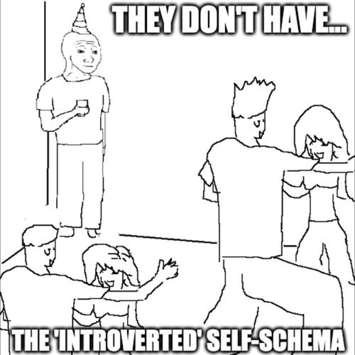

The psychology of self is much more straightforward than I expected. All I had to do was search for 'Self-\*' - most things related to self were helpfully titled some variant of Self-*Something*. Starting with the Self-Concept.

### Self-Concept and Self-Schema

Your self-concept is the collection of beliefs you hold about yourself. These smaller, specific beliefs are called the Self-schema. They are old sets of memories that would have generalized into beliefs about yourself. For eg, the Self-schema/belief that 'I am introverted'.

A major feature of this self-schema is that it acts like a self fulfilling prophecy. On one side, your self-schema tells you how to act. And on the other side, it highlights the memories of the times you acted that way. If you have a self-schema that says 'I am introverted', that will drive your actions at a party(stand by yourself in one of the corners of the room). And when you try to remember the last party you went to, you will tend to remember it in a way that supports your existing belief that you are an introvert: "I hated going to the party because I didn't want to interact with people".

These self-schemas are generally given to us in our childhood by our caregivers when they tell us how to behave. For eg. "Good girls don't make noise." Lot of our current behaviors come from these "Good child/bad child" schemas. Transactional Analysis(a system of therapy) says that these childhood schemas can lead to lifelong standards you hold yourself to - called Drivers...

- **Be Perfect**: "You are worthy only if you get everything right"
- **Be Strong**: "You are worthy only if you hide your feelings and wants"
- **Please Others**: "You are worthy only if you please people"
- **Try Hard**: "You are worthy only if you keep trying hard to do things" 
- **Hurry Up**: "You are worthy only if you get everything done right now"

PS: If you are curious to know what your drivers are, I have created a form that can help you figure it out: [TA Drivers](https://apps.binnyva.com/ta-drivers/).

### Self-Esteem

While Self-concept is the belief of who we are(eg. I am introverted), Self-esteem is the value we attach to such a belief(eg. I hate that I am introverted).

> "The self-concept is what we think about the self; self-esteem, is the positive or negative evaluations of the self, as in how we feel about it"

Abraham Maslow included self-esteem in his famous "Maslow's Hierarchy of Needs". It has two forms of "esteem"...

- From other in form of respect, recognition or admiration
- From yourself in the form of self-confidence, self-worth: self-esteem.

If you are curious to understand how much self esteem you have, there are tests that can measure it - like Rosenberg self-esteem scale.

### Self-Image

Self-Image is how we see ourselves. It can be about your physical self(eg. I am tall) or about your current situation(Eg. I am a victim). These are stable beliefs - it's not very easy to change. It can be 

- Objective(height, weight, color of hair)
- Internalized judgements(short, fat)

As you can imagine, this influences your self-esteem.

### Ideal Self

This refers to who we want to be. This can be our long term goals, ambitions, etc. One interesting fact about your Ideal self is that it is dynamic. It is easier to change than most of the other components we have discussed thus far.

### Humanistic theory of personality

All the above ideas come from the work of Carl Rogers and Abraham Maslow. This branch of psychology was known as 'Humanistic Psychology'.

According to Carl Rogers, the growth of your self depends on what your environment gives you. For a healthy self, you would want these things...

- Genuineness: You should be able to express yourself freely
- Positive Regards: You are accepted unconditionally by the people around you 
- Empathy

The best time to have such an environment is as a child. If that is not possible, as I am assuming for most of you readers, the next best time to have these things is now.

## Self-Categorization Theory

There are other theories about the self that are very different from the Humanistic approach. One such method is the Self-categorization theory. It says that the self-concept has two levels...

- Personal Identity: Labels you give yourself.
- Social Identity: Which all groups you belong to.

Everyone automatically categorizes themselves and people around them into different groups. This can be based on many criteria - observable and non-observable. The goal of this behavior is to understand who is our 'in-group' and who is our 'out-group'.

Social Identity theory tries to explain inter-group behaviors as a result of...

- Difference in status within the group
- Legitimacy and stability of the status differences
- Ability to move to another group

Some consequences of this behavior...

- In-group Favoritism
- Help other people in your own group
- Reluctance to bet against the group even if you are negatively affected by it

There is an interesting test to find which groups you put yourselves into: Thomas Kuhn's Twenty Statement Test. It's just a fill in the blank with the same question repeated 20 times: **I am \_\_\_\_\_\_\_\_\_**. You'll be given 10 mins to think of as many answers as you can. The answers fall into these groups...

- Social Groups(eg. I'm an Indian)
- Ideological Beliefs(eg. I'm a communist)
- Interests(I am a photographer)
- Ambitions(I am a entrepreneur)
- Self-Evaluations(I am a good person)

## Next Steps

This article series started as a search for a process that helps people know themselves better. The [last](https://mindos.in/posts/12-know-thyself/) few [articles](https://mindos.in/posts/13-philosophy-self/) were the research phase. I think that phase has come to an end.

Now I have to collate all this knowledge into something useful: some content that will let people understand themselves better. I'm not sure what the end product is - might be a series of videos, or an app, or even a book(like my [last one](https://mindos.in/zettelkasten-art-of-knowledge-management/)). My next step is to decide that.

Wish me luck! 😀
